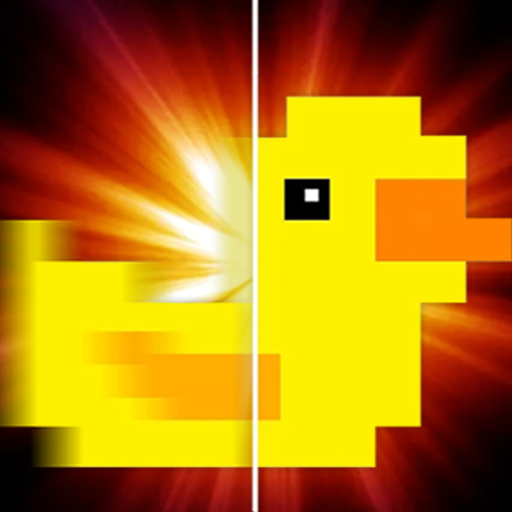

# 小黄鸭2.0

这是 [Decky LSFG-VK](https://github.com/xXJSONDeruloXx/decky-lsfg-vk) 的非官方中文发行版，基于作者的 **v0.14.4** 完整包。它不是 MAKO。下载时请选择 Release 中的 `Decky.LSFG-VK-zh-v0.14.4.zip`，不要使用 GitHub 自动生成的“Source code”压缩包。

安装后在 Decky 中打开 **小黄鸭2.0**。请勿与官方版或旧汉化版同时修改游戏配置，因为它们操作的是同一套 LSFG-VK 环境。原作者和许可信息保留于下方。

> **Note:**  
> This is an **unofficial community plugin**. It is independently developed and **not officially supported** by the creators of Lossless Scaling or lsfg-vk. For support, please use the [decky-lsfg-vk Discord Channel](https://discord.gg/TwvHdVucC3).

   

   

## What is this?

A Decky plugin that streamlines the installation of **lsfg-vk** ([Lossless Scaling Frame Generation Vulkan layer](https://github.com/PancakeTAS/lsfg-vk)) on Steam Deck, allowing you to use the Lossless Scaling frame generation features on Linux with a controller friendly UI in SteamOS, Bazzite, or any other Linux platform compatible with Decky Loader.

## Installation

1. **Download the complete Chinese plugin** from this repository's [releases tab](../../releases)
   - Download `Decky.LSFG-VK-zh-v0.14.4.zip` to your Steam Deck
2. **Install manually through Decky**:
   - In Game Mode, go to the settings cog in the top right of the Decky Loader tab
   - Enable "Developer Mode"
   - Go to "Developer" tab and select "Install Plugin from Zip"
   - Select the downloaded `Decky.LSFG-VK-zh-v0.14.4.zip` file

## How to Use

1. **Purchase and install** [Lossless Scaling](https://store.steampowered.com/app/993090/Lossless_Scaling/) from Steam
2. **Open the plugin** from the Decky menu
3. **Click "Install lsfg-vk"** to automatically set up the lsfg-vk vulkan layer
4. **Configure settings** using the plugin's UI - adjust FPS multiplier, flow scale, performance mode, HDR settings, and experimental features
5. Select a game in the Steam, Non-Steam, or Flatpak tab and use the plugin's profile controls. Do not copy launch commands from old versions.
6. **Launch your game** after the profile is enabled.

## Configuration Options

The plugin provides several configuration options to optimize frame generation for your games:

### Core Settings
- **FPS Multiplier**: Choose between 2x, 3x, or 4x frame generation
- **Flow Scale**: Adjust motion estimation quality (lower = better performance, higher = better quality)
- **Performance Mode**: Uses a lighter processing model - recommended for most games
- **HDR Mode**: Enable for games that support HDR output

## Feedback and Support

For per-game feedback and community support, please join the [decky-lsfg-vk Discord Channel](https://discord.gg/TwvHdVucC3)

## Troubleshooting

**Frame generation not working?**
- Check whether the game profile is enabled in the plugin and whether the Lossless Scaling branch setup is complete.
- Check that the Lossless Scaling DLL was detected correctly in the plugin
- Try enabling Performance Mode if you're experiencing crashes
- Make sure your game is running in fullscreen mode for best results

**Performance issues?**
- Lower the Flow Scale setting for better performance
- Enable Performance Mode (recommended for most games)
- Try reducing the FPS multiplier from 4x to 2x or 3x
- Consider using the experimental FPS limit feature for DirectX games

## What it does

The plugin:
- Automatically downloads and installs the latest lsfg-vk Vulkan layer to `~/.local/lib/`
- Configures the Vulkan layer in `~/.local/share/vulkan/implicit_layer.d/`
- Creates a TOML configuration file in `~/.config/lsfg-vk/conf.toml` with your settings
- Automatically detects your Lossless Scaling DLL installation
- Provides an easy-to-use interface to configure frame generation settings:
  - **FPS Multiplier**: Choose 2x, 3x, or 4x frame generation
  - **Flow Scale**: Adjust motion estimation quality vs performance
  - **Performance Mode**: Use lighter processing for better performance
  - **HDR Mode**: Enable for HDR-compatible games
  - **Experimental Features**: Override present mode and set FPS limits
- **Hot-reloading**: Configuration changes apply immediately without restarting games
- Easy uninstallation that removes all installed files when no longer needed

## Credits

- **[PancakeTAS](https://github.com/PancakeTAS/lsfg-vk)** for creating the lsfg-vk Vulkan compatibility layer
- **[Lossless Scaling](https://store.steampowered.com/app/993090/Lossless_Scaling/)** developers for the original frame generation technology
- **[Deck Wizard](https://www.youtube.com/@DeckWizard)**  - Extensive community support including comprehensive guides, promotional content, thorough testing and feedback, custom artworks, and tutorial videos. His passionate advocacy and continuous support have been instrumental in this plugin's success.
- The **Decky Loader** team for the plugin framework
- Community contributors and testers for feedback and bug reports
